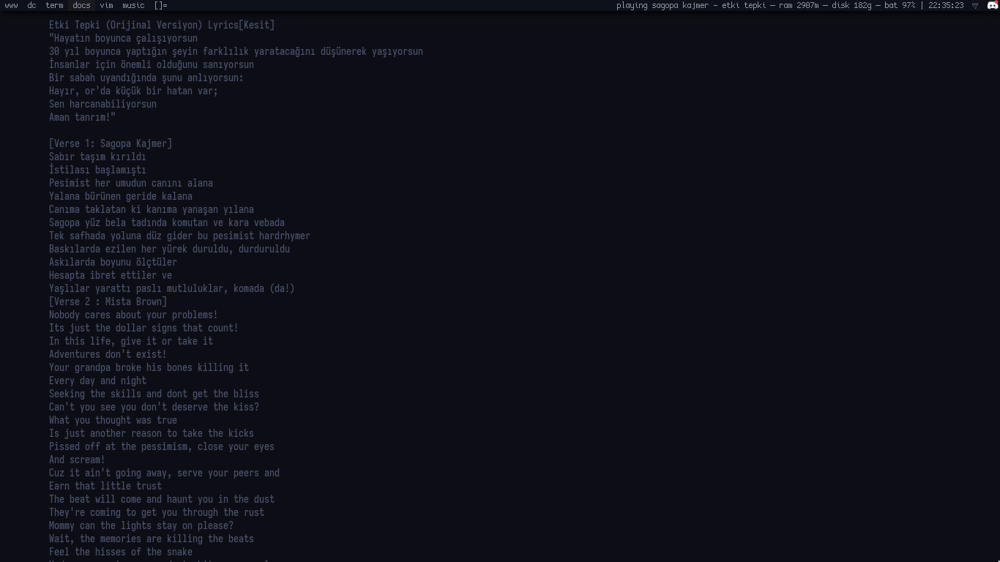

## description
write current song's lyrics on your wallpaper.
# TODOs:
- [ ] Add Marquee option for lyrics (will probably use more resource)  

## installation
copy config.example.py to /home/USERNAME/.config/walyrics/config.py

copy `env.example` to `.env` and use your own Genius(c) APIKEY

you have to specify your .env path in your walyrics config

### dependencies

you need `lyricsgenius, pillow, playerctl, feh` to run wal

### example screenshot

